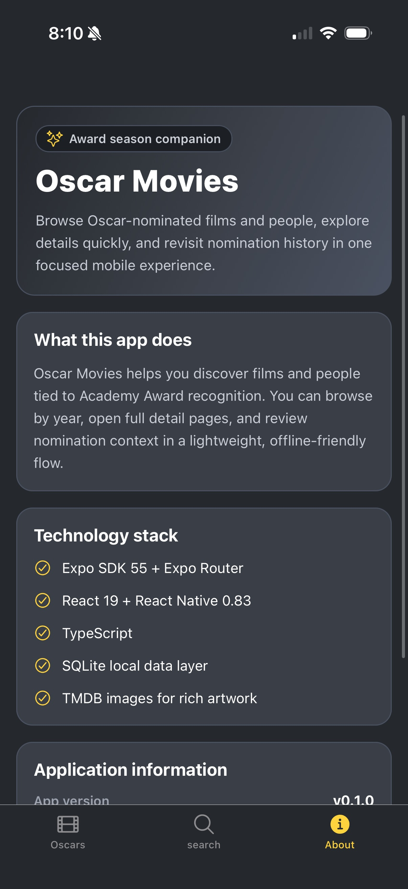

# Oscar Movies

Oscar Movies is an Expo-based mobile application for exploring Oscar-nominated films and the people connected to them. It combines a bundled SQLite database with rich artwork and a focused browsing experience, making it easy to review winners, nominations, and award history across years.

## Overview

Oscar Movies is designed as a lightweight, offline-friendly reference app for Academy Awards exploration. Users can browse nominees by ceremony year, search across films and people, open detailed profile screens, and review nomination history without depending on a live backend for core app functionality.

The experience is built around quick navigation, clear presentation, and locally bundled data, with TMDB artwork used to enrich film and person detail views.

## Core Features

- Browse Oscar nomination categories by year
- Explore nominated films across Academy Award categories
- Search films by title and people by name
- Open detailed film pages with artwork, credits, and nomination summaries
- Open person pages with biography details, related films, and nomination totals
- Review nomination history for both films and people
- Use a bundled local SQLite database for a fast, offline-friendly experience

## Technology Stack

- Expo SDK 55
- React Native 0.83
- React 19
- TypeScript
- Expo Router for file-based navigation
- Expo SQLite for the bundled local database
- Expo Image and TMDB artwork for rich visuals

## Screenshots

### Oscars Landing


Browse Oscar nomination categories for a selected year from the main landing screen.

### Search Landing


Start from a dedicated search screen and switch between film and people results.

### Movie Search


Search for films and review matching results with artwork, release details, wins, and nominations.

### Film Detail


Open a film detail page to view artwork, overview, credits, and Oscar recognition.

### Person Detail


View a person profile with biography details, related films, and nomination totals.

### About



Review the app summary, platform support, and core technology choices.

## Getting Started

### Prerequisites

- Node.js and npm
- Xcode for iOS development on macOS
- Android Studio for Android development

### Install Dependencies

```bash
npm install
```

### Start the Development Server

```bash
npx expo start
```

### Run on Specific Platforms

```bash
npm run ios
npm run android
npm run web
```

### Lint the Project

```bash
npm run lint
```

## Available Scripts

- `npm run start` starts the Expo development server
- `npm run ios` runs the app on iOS
- `npm run android` runs the app on Android
- `npm run web` runs the app on the web
- `npm run lint` runs the Expo lint configuration
- `npm run test` runs the Jest test suite
- `npm run seed` seeds the local Oscar movie database
- `npm run enrich` runs the main data enrichment workflow
- `npm run enrich-people` enriches person records
- `npm run enrich-person-by-id` enriches a single person record
- `npm run enrich-cast-people` enriches cast-related people data
- `npm run import-popular-movies` imports additional movie popularity data
- `npm run import-popular-people` imports additional people popularity data
- `npm run import-movie-cast` imports movie cast relationships

## Data and Content Notes

Oscar Movies uses a bundled local SQLite database to power browsing and search. This keeps the app responsive and usable without depending on a live backend for its primary experience.

Film and person artwork are sourced from TMDB image paths where available. Repository scripts in `assets/data` are used to seed and enrich the Oscar-related dataset used by the app.

## Future Improvements

- Expanded filtering and sorting options
- More detailed ceremony and category context
- Additional test coverage for data-loading and navigation flows
- Further enrichment of people, cast, and nomination relationships
